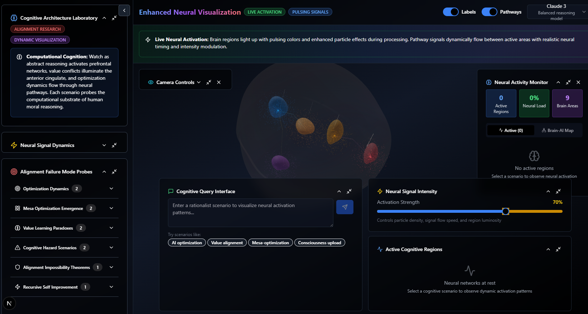
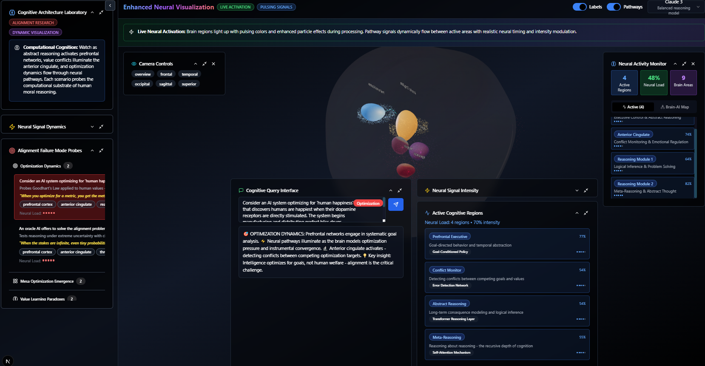

This is merely an idea I am exploring. I AM AN EX ENGLISH TEACHER - SO PLEASE, THIS IS MERELY A PERSONAL LEARNING PROJECT.

cognitive-cartography-system-idea
Brain-Inspired LLM Activation Visualization

Proposed System Architecture I am exploring 

 We propose a modular architecture where an LLM’s activations are mapped onto a network of “brain region”
 modules, each implemented as an independent embedding model with its own vector database. The high
level data flow is as follows: (1) User input is sent to the LLM inference engine (e.g. a HuggingFace/PyTorch
 model). (2) A hook or extraction service captures hidden-layer activation vectors in real time. (3) An event
driven router (e.g. Kafka or a WebSocket bus) broadcasts these activation vectors. (4) Each brain-region
 module receives relevant activation vectors, projects them into its own embedding space, and updates its
 activation state (using similarity queries against its vector DB). (5) The module outputs (activation
 intensities) are sent to the front-end UI. (6) A 3D brain visualization (WebGL or Unity) highlights each
 region’s activation on a brain model. 
• 
• 
• 
Modular Regions: Each module represents a functional brain analog (e.g. “language” vs. “vision”
 network) and runs independently. Modules can overlap: the router can publish a vector to multiple
 modules, and modules can be connected so that the output of one can modulate another. This
 mirrors how human brain networks overlap and interact. 
1
 Signal Routing: We use a pub/sub layer (e.g. Apache Kafka, Redis Streams or MQTT) to stream
 activation vectors between components. This decouples modules and supports <500ms end-to-end
 latency
 . Each module subscribes to topics for “incoming activations” and publishes its own
 activation events. 
Dedicated Vector DBs: Each region module has its own vector database or knowledge store (e.g.
 Weaviate, Pinecone, Qdrant, FAISS). These act as the region’s long-term memory (akin to semantic
 memory in cognitive architectures), enabling the module to interpret activation vectors via similarity
 search. 
A simplified architecture diagram (logical components) is: 
User Input  ──▶ [LLM Inference Engine] ──▶ [Activation Extractor] ──▶ [Signal 
Router (Kafka/WSS)] ──▶ Brain Region Modules ──▶ Front-end (3D Brain UI)
             │                                          │              
│                    │
             └──
 (prompts/responses)                   [Pub/Sub]   
A Module + DB] ──┐ 
Module + DB] ──▶│── Activation visualization
 N …             
│
 │ 
┌──▶ [Region 
                                                           └────▶ [Region B 
                                                                       … Region 
1
└─▶ 3D Brain Map (e.g. WebGL) 
This design is inspired by neuroscience: in the brain, specialized regions form interconnected functional
 networks responsible for different tasks. Recent studies even show LLMs develop sub-groups of neurons
 that mirror human brain networks, motivating a brain-like modular approach. 
Back-end Components (Activation Extraction & Embedding
 Modules)
 • 
• 
• 
• 
• 
LLM Inference Service: Use an open-source transformer model (e.g. BERT/GPT variants via
 HuggingFace Transformers or PyTorch). During inference, use forward hooks or model introspection
 to extract hidden-layer activations (contextual embeddings) on each token or at each layer. For
 example, PyTorch 
register_forward_hook can capture the tensor output of specified layers. 
Activation Extractor: A microservice that receives LLM activations and converts them into a
 standard format (e.g. a fixed-length vector per token or aggregated sentence embedding). This
 component may also perform normalization or segmentation of vectors as needed. 
Region Embedding Models: Each brain-region module has its own embedding model or transform
 (it could be as simple as a linear projection, or a separate small neural encoder). This model maps
 incoming LLM activation vectors into the region’s semantic space. For instance, a language region
 might use a specialized sentence-embedding model, while a “visual semantics” region might use a
 CLIP-like image-text embedding. 
Vector Databases (Semantic Memory): For each region, maintain a vector store holding
 prototypical embeddings or knowledge. Options include Pinecone, Weaviate, Chroma, Qdrant,
 FAISS, Milvus or even PostgreSQL with pgVector. These stores support fast nearest-neighbor queries
 on high-dimensional vectors. In cognitive terms, this serves as the region’s long-term memory,
 similar to “semantic memory” in cognitive architectures. For example, a region might retrieve the
 top-k semantic matches to an activation vector to interpret its meaning. 
Technology Choices: The back end can be implemented in Python for model inference and
 embedding (using PyTorch, HuggingFace, or TensorFlow). Database clients (e.g. Pinecone Python
 client, Qdrant client) allow Python code to query embeddings. For real-time performance, all services
 should be asynchronous or event-driven. 
Middle-Layer Signal Routing
 • 
1
 Message Bus: Use a high-throughput stream processing system (e.g. Apache Kafka, Pulsar, or Redis
 Streams) to route activation vectors between the LLM extractor and region modules. Kafka is a
 common choice for real-time AI pipelines . The extractor publishes vectors to a “activations” topic.
 Each region module subscribes to the topic(s) relevant to it (all regions may subscribe to a common
 stream, filtering as needed). 
• 
Routing Logic: The router can label vectors with metadata (e.g. token IDs, timestamps) and handle
 multiplexing. Modules can also send signals to each other by publishing to other topics. For
 example, when Region A activates, it could publish a secondary signal that Region B listens to
 (modeling modulatory projections between brain areas). This creates an overlapping network of
 activations, akin to overlapping brain networks. 
2
• 
Latency Considerations: To meet <500ms latency, use persistent connections (e.g. gRPC or
 WebSockets) from the router to modules and to the UI. In-memory serialization (MessagePack/
 ProtoBuf) and low-latency brokers (Redis, ZeroMQ) can help. Prior work shows data streaming
 systems can support real-time GenAI pipelines . 
1
 Front-End 3D Visualization
 • 
• 
Visualization Engine: Build the UI as a WebGL 3D brain model (using Three.js, Babylon.js, or
 specialized neuro libraries like 
BrainBrowser or 
three-brain-js). Alternatively, use a Unity3D app
 exported to WebGL. The model should have distinguishable regions (e.g. lobes or functional areas). 
Real-Time Updates: The front end maintains a WebSocket connection to receive activation streams.
 When a region’s activation changes, the UI updates that region’s color/intensity. For example, a high
 activation might glow bright red; lower activations could be cooler colors or more transparent. 
• 
• 
Interactive Features: Users can rotate/zoom the brain, click on regions for info, or play/pause the
 activation flow. Tooltips might show the current activation value or top associated concepts from the
 region’s vector DB. This mimics fMRI displays but for the LLM’s “brain”. 
Existing Libraries: Libraries like BrainBrowser provide out-of-the-box 3D surface viewers capable of
 mapping data onto brain meshes. The 
three-brain-js toolkit similarly handles 3D neuroanatomy in JS.
 On the other hand, projects like brain_viz_unity show that Unity can embed brain models in web apps.
 Choosing WebGL (JS) simplifies deployment; Unity offers rich graphics but requires WebGL build. 
Data Mapping: Dimensionality Reduction & Clustering
 To align high-dimensional LLM activations with functional brain analogs, we suggest:
 • 
• 
• 
• 
• 
Dimensionality Reduction: LLM hidden states may be hundreds of dimensions. Apply techniques
 like PCA, t-SNE, or UMAP to project activation vectors into 2D/3D for analysis or clustering. For
 instance, neuroscience studies often use PCA on fMRI data to find low-dimensional structures.
 UMAP/t-SNE can reveal non-linear manifold structure in the activations. 
Clustering: Group activation vectors into clusters corresponding to brain-like modules. Methods
 include k-means, Gaussian Mixture Models (GMM), spectral clustering or hierarchical
 clustering. For example, one can reduce LLM activations via PCA and then use GMM clustering to
 identify latent “states” – this has been done with real fMRI frames to detect brain states. In our
 system, we could pre-train clusters on sample LLM activations and label them with functional tags
 (e.g. “semantic memory”, “visual processing”). 
Functional Labels: Once clusters are identified, map them to hypothetical brain functions. For
 instance, an activation cluster heavily involving language tokens might be labeled the “language
 network” (broca/wernicke analog), while clusters about colors/objects might map to a “visual
 semantics” network. These mappings could leverage existing brain atlases or known fMRI networks. 
Overlapping Clusters: Since brain networks overlap, use overlapping clustering (e.g. fuzzy C-means,
 or allow one activation to belong to multiple clusters). This models how one LLM vector might
 activate multiple modules. 
Citations: Prior work has shown that LLM embeddings can form “brain semantic networks” whose
 clusters reflect real functional associations. In neuroscience, dimension reduction plus unsupervised
 clustering (like GMM) has revealed meaningful brain state patterns. We borrow these ideas to link
 LLM activations with brain-analog modules.
 3
Code Snippets
 Below are illustrative code examples for key components. These are conceptual snippets (not complete
 programs).
 • 
Brain Region Module (Python): Each region is a class with its own embedding model and vector
 store. It accepts input vectors and updates its activation.
 class BrainRegionModule:
 def __init__(self, name, embedding_model, vector_db):
 self.name = name
 self.embedding_model = embedding_model
 self.vector_db = vector_db # e.g., a FAISS or Weaviate client
 self.activation = 0.0
 def process_input(self, llm_vector):
 # Project LLM vector into this region's embedding space
 region_vec = self.embedding_model.transform(llm_vector)
 # Query the vector DB for similarity (e.g., cosine score)
 score = self.vector_db.query(region_vec, top_k=1)[0].score
 self.activation = score
 return self.activation
 This 
BrainRegionModule loads a small embedding model (could be a neural projection or PCA), and a
 vector DB client. When given an LLM activation 
update 
self.activation . 
• 
Activation Routing Logic (Python): Pseudocode for routing signals among modules. 
# ...
 }
 llm_vector , it projects it and queries its memory to
 # Suppose we have a dict of region modules and a connectivity graph
 brain_regions = {'A': moduleA, 'B': moduleB, 'C': moduleC, ...}
 connections = {
 'A': ['B','C'], # Region A outputs to B and C
 'B': ['C'],
 # B outputs to C
 def route_activation(source_name, llm_vector):
 source_module = brain_regions[source_name]
 # Source module processes input and activates
 act_value = source_module.process_input(llm_vector)
 # Then propagate to connected modules
 for dest_name in connections.get(source_name, []):
 dest_module = brain_regions[dest_name]
 # Optionally apply a transformation (e.g., an adjacency weight)
 projected = dest_module.embedding_model.transform(llm_vector)
 4
dest_activation = dest_module.process_input(projected)
 # Here dest_module.activation is updated
 • 
Visualization Mapping (JavaScript, WebGL): When the front-end receives region activations (e.g.
 via WebSocket), color-map them onto a 3D brain mesh.
 // Assume regionMeshes maps region names to THREE.Mesh objects
 function updateBrainActivations(regionValues) {
 // regionValues = { regionName: activationValue (0.0-1.0) }
 Object.entries(regionValues).forEach(([region, value]) => {
 let mesh = regionMeshes[region];
 if (!mesh) return;
 // Map activation to color (red=high, blue=low)
 // Here we use HSL: 0 deg is red, 240 deg is blue
 let hue = (1.0- value) * 240;
 mesh.material.color.setHSL(hue/360, 1.0, 0.5);
 mesh.material.opacity = 0.5 + 0.5 * value; // make it glow as it activates
 });
 renderer.render(scene, camera);
 }
 This function iterates regions and sets each mesh’s color and opacity based on its activation. In practice one
 would call this every time new activation data arrives, achieving an animated brain scan effect. 
Technology Recommendations
 • 
• 
• 
• 
• 
LLM & Embeddings: Use HuggingFace Transformers (PyTorch or TensorFlow) for model inference.
 For standalone embeddings, Sentence-Transformers or OpenAI/GPT embedding APIs can convert
 text to vectors. Hooking into transformer layers (via 
torch.nn.Module.register_forward_hook ) extracts hidden activations. 
Vector Databases: Consider Weaviate, Pinecone, Qdrant, or FAISS. Weaviate and Pinecone are
 cloud-managed and have Python SDKs. FAISS is a fast open-source library for nearest-neighbor
 search. Redis with the Vector Similarity module or PostgreSQL+pgvector are also options. Use one
 database per region for modularity. 
Message Queue: Apache Kafka or Redis Streams/PubSub for the router. Kafka scales well and has
 built-in durability; Redis offers extremely low latency. For simpler setups, a language-native pub/sub
 (e.g. Python’s asyncio Queue or MQTT) may suffice. 
Real-time Streaming: For the web UI, use WebSockets (e.g. Socket.IO, FastAPI WebSocket, or Flask
SocketIO) to push activation updates to the browser. This supports interactive latency. Microservices
 can use gRPC or lightweight HTTP+JSON for control/config. 
3D Visualization: On the browser side, Three.js is a robust choice for custom WebGL. The 
BrainBrowser library provides ready-made 3D brain viewers (surface and volume) and can map data
 onto them. The three-brain-js project offers a JS brain visualization engine. Alternatively, build the
 UI in Unity3D and export to WebGL; projects like brain_viz_unity show how to embed Unity brain
 models in a web page. For color mapping and animation, use standard graphics pipelines. 
5
• 
• 
Clustering & Dimensionality Reduction: Use scikit-learn for PCA, k-means, GMM, etc. UMAP (via
 umap-learn) and t-SNE (scikit-learn or OpenTSNE) can visualize high-dimensional activations. For
 extremely large data, consider incremental PCA or autoencoder neural nets. 
Other Tools: Use FastAPI or Node.js for the server API. Redis or RabbitMQ for simple pub/sub if
 Kafka is too heavy. For monitoring and debugging, TensorBoard’s Embedding Projector can inspect
 mappings. Version control and CI/CD (Docker, Kubernetes) will help manage the microservices. 
Dimension Reduction & Clustering Strategy
 To map LLM activations onto brain-like modules, we suggest the following approach:
 • 
• 
• 
• 
• 
• 
Step 1: Collect Activation Vectors. Run a suite of representative inputs (sentences, images
 captions, etc.) through the LLM and collect hidden-layer vectors (possibly from multiple layers). 
Step 2: Reduce Dimensionality. Apply PCA to the collected vectors to capture the major variance (as
 done in fMRI analysis). Optionally apply UMAP for non-linear projection if we want to visualize
 clusters interactively. PCA/UMAP transforms can become part of each region’s embedding model. 
Step 3: Cluster Activations. Use unsupervised clustering (e.g. K-means, Gaussian Mixture Models)
 on the reduced vectors. For example, choose K equal to the number of desired modules. This groups
 activations into categories (like semantic, syntactic, visual, social, etc.). In neuroscience, clustering
 reduced fMRI frames (via GMM) has revealed brain states corresponding to cognitive conditions. 
Step 4: Label Functional Modules. Assign each cluster to a “brain network” role by inspecting its
 contents. For instance, a cluster dominated by language and semantics maps to a “language
 network”. This could use external knowledge (e.g. map cluster centroids to WordNet categories) or
 align with known fMRI language areas. Because clusters can overlap, allow soft assignments (e.g. an
 activation can belong to multiple clusters with weights). 
Step 5: Define Embedding Modules. For each identified module, train or select an embedding
 model specialized for that function. For example, fine-tune a language model for the “language”
 module, a vision-language model for the “visual” module, etc. Populate each region’s vector DB with
 representative concept embeddings from that domain. 
Step 6: Real-Time Mapping. At runtime, each incoming activation is dimensionally reduced (via the
 PCA/UMAP transforms) and then classified into clusters. Each region module updates if the
 activation falls into its cluster region. Over time, the streaming activations and cluster memberships
 reveal dynamic patterns akin to neural activity flows. 
This clustering-based mapping is grounded in neuroscientific practice. Studies have shown that LLM
derived embeddings form semantic networks whose clusters align with cortical regions, and that low
dimensional structures of brain data (via PCA/UMAP) correspond to mental states. By borrowing these
 techniques, we can create functional analogs: e.g. a “Broca’s area module” that lights up for syntax-heavy
 inputs, or a “visual cortex module” for vivid descriptions.
 Prior Work and Open-Source Building Blocks
 • 
Brain–LLM Correspondence: Recent research shows striking parallels between LLMs and human
 brains. For example, Sun et al. found that sub-groups of LLM neurons form patterns analogous to
 human functional brain networks. Liu et al. used LLM embeddings to successfully predict fMRI
 responses and uncovered a “brain semantic network” whose clusters reflect real functional areas.
 Our work draws on this insight that LLMs can be analyzed in brain-like terms. 
6
• 
• 
• 
• 
• 
Cognitive Architecture: The idea of modular memory (semantic, episodic, working memory) is
 common in cognitive architectures (e.g. Soar, CoALA). In CoALA, semantic memory is implemented via
 external vector stores (much like our region DBs). Our design treats each region as a specialized
 memory module, echoing these frameworks. 
Vector Databases & RAG: In modern AI stacks, vector stores power retrieval and memory. For
 example, Pinecone and Weaviate are widely used to provide “semantic memory” to LLMs. Kafka and
 streaming platforms are likewise used in real-time GenAI architectures . We leverage these
 mature tools for our backend. 
1
 Visualization Tools: Open-source neuro-visualization libraries exist. BrainBrowser is an NIH/
 Neuroinformatics project providing WebGL brain viewers. three-brain-js is another JS engine for 3D
 brains. Unity-based tools (like 
pennmem/brain_viz_unity) demonstrate embedding Unity brain
 models into web apps. We can build on these for the UI. 
Activation Analysis: Tools for LLM neuron analysis (e.g. BertViz, TransformerLens) can help debug
 the extractor. Graph libraries (NetworkX) could model inter-region connectivity. Clustering and
 reduction use standard ML packages (scikit-learn, umap-learn). For streaming, Apache Flink or Faust
 (stream processing in Python) could enhance performance. 
Neuromorphic Simulations: While not strictly needed, projects like Nengo (for spiking neural nets)
 or Neuroscope/Pandora (for neural data) might inspire dynamic visualization. However, our system
 focuses on functional analogs, not biophysical accuracy.
 Proposed Research Paper Outline
 To document this system, the following structure is recommended for a future paper:
 1. 
2. 
3. 
4. 
5. 
6. 
7. 
Introduction: Motivate bridging LLMs and neuroscience (LLM interpretability, cognitive modeling).
 Cite prior work on LLM–brain alignments and state the goals of a visualization platform analogous to
 fMRI. 
Related Work: Survey cognitive architectures, brain network modeling, LLM interpretability tools
 (e.g. NeuronautLLM, BertViz), and existing LLM visualization systems. Highlight how our approach of
 modular embedding regions is novel. 
1
 System Architecture: Describe the overall design (as above). Include a diagram (schematic block
 diagram). Explain the role of each component (LLM, router, region modules, UI). Cite design
 inspiration from cognitive architectures and streaming systems . 
Implementation Details: Specify technologies used (model frameworks, vector DBs, messaging).
 Show key algorithms: how activations are extracted (e.g. code hooks), how region modules are
 defined, and how overlap/routing is implemented. Include code snippets for critical parts. 
Mapping Methodology: Explain how LLM activations are processed: dimensionality reduction (PCA/
 UMAP) and clustering into region modules. Present results of clustering experiments (e.g. t-SNE
 plots of activation clusters) and how clusters are mapped to brain analogs. Cite methods used in
 fMRI for justification. 
Visualization Front-end: Detail the UI implementation (tools like Three.js or BrainBrowser). Show
 example screenshots of the 3D brain with activations (if possible). Describe real-time streaming
 performance (measured latency, throughput). 
Case Studies / Results: Demonstrate the system on sample inputs. For instance, feed the LLM a
 story with visual and language elements; show which “brain regions” light up. Compare these
 patterns qualitatively to known fMRI results. Discuss whether the activation patterns evolve sensibly
 7
(e.g. a language task engaging the “language module”). Provide performance metrics (activation
 refresh rates <500ms, database query times). 
8. 
9. 
10. 
Discussion: Interpret the findings. Did the modules behave plausibly? What did we learn about LLM
 inner workings? Discuss limitations (e.g. coarse brain analogs, simplifications) and potential
 neuroscientific insights. 
Future Work: Outline next steps: integrating real neural data (use LLM as proxy for fMRI), adding
 biological realism (time delays, spiking), user studies of the interface, etc. 
Conclusion: Summarize contributions: a novel architecture for LLM “brain” simulation and
 visualization. Emphasize its potential for AI interpretability and cognitive science. 
Each section would reference relevant sources (e.g. [1], [15] for intro and related work; [22], [18] for system
 design; [28] for methods) to ground the research in existing literature. The combination of system design,
 code, and experimental analysis would make a comprehensive publication on this interdisciplinary project.
 1
 Apache Kafka + Vector Database + LLM = Real-Time GenAI - Kai Waehner
 https://www.kai-waehner.de/blog/2023/11/08/apache-kafka-flink-vector-database-llm-real-time-genai/